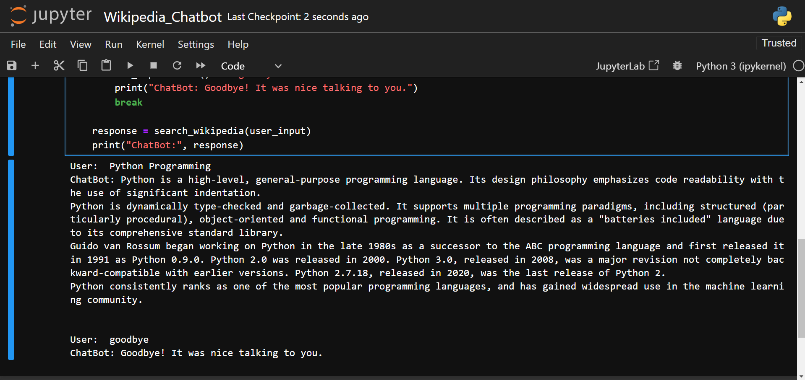

# Wikipedia Chatbot 🤖📚

This is a Python-based chatbot that fetches information from Wikipedia based on user queries. Using the Wikipedia library, the chatbot provides concise answers and handles errors gracefully, such as disambiguation pages or missing articles. It offers a conversational interface for user interaction.

## Features 🌟

- Retrieves information from Wikipedia based on user input.
- Handles disambiguation errors and suggests alternatives.
- Handles missing pages gracefully and notifies the user.
- Simple and interactive conversational interface.

## Screenshots 📷



## Libraries Used 📦

- `wikipedia`: Python library to fetch content from Wikipedia.
- `Python`: The programming language used to implement this project.
  
## How It Works ⚙️

1. **User Query**: Enter a question or topic you want to know about.
2. **Wikipedia Search**: The chatbot searches Wikipedia for the query.
3. **Response**: Provides a summarized answer or notifies if there are issues like disambiguation or missing pages.

## Prerequisites 📝

- Python 3.6 or higher
- Jupyter Notebook (for running the `.ipynb` file)

## Setup 🛠️

1. **Clone the repository**:
   ```bash
   git clone https://github.com/sanketjadhav09/Wikipedia-Chatbot.git
   cd Wikipedia-Chatbot
   ```
2. **Install the required libraries**:
   ```bash
   !pip install wikipedia
   ```

3. **Run the program**:
   ```bash
   Wikipedia_Chatbot.ipynb
   ```

## Usage 🚀

1. Run the `Wikipedia_Chatbot.ipynb` Jupyter notebook file.
2. Follow the prompts to input your query.
3. The chatbot will fetch and display information from Wikipedia.

## Project Structure 🗂️

```
Wikipedia-Chatbot/
├── Wikipedia_Chatbot.ipynb   # Jupyter Notebook implementation
├── Output.png                # A screenshot of the chatbot in action.
├── LICENSE                   # MIT License file.
└── README.md                 # Project documentation
```

## License 📄

This project is an open-source and available under the [MIT LICENSE](LICENSE).

## Acknowledgements and Contributions 💡

- Special thanks to **my mentors** for their guidance and support throughout the development of this project.  
- This project was completed in a **Jupyter Notebook Environment**, which provided an interactive and efficient platform for implementation.  
- **Contributions are welcome!** If you have ideas for improvements or additional features, feel free to fork the repository, make changes, and submit a pull request. Your contributions are greatly appreciated!
  
